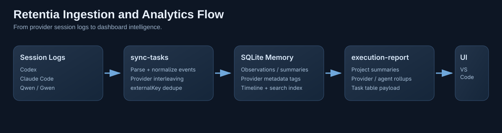

# Retentia

[](./LICENSE)
[](https://nodejs.org/)
[](https://www.typescriptlang.org/)
[](https://modelcontextprotocol.io/)
[](./vscode-extension)

Retentia is an open-source MCP memory and task execution intelligence layer for OpenAI Codex, Claude Code, Qwen, and Gwen. It provides persistent SQLite-backed memory, multi-agent task tracking, and a visual VS Code dashboard for execution observability.

Compatibility note:
- Primary CLI command is now `retentia`.
- Legacy alias `codex-mem` is still supported.


## Why Retentia

- Persist high-signal coding memory across sessions and repositories.
- Observe multi-agent pipelines by provider, model, agent, role, and status.
- Use MCP-native memory tools from Codex-compatible clients.
- Keep data local with a lightweight worker and SQLite backend.
- Inspect execution KPIs, project outcomes, and task history in VS Code.

## Table of Contents

- [What Retentia Does](#what-retentia-does)
- [Use Cases](#use-cases)
- [Quick Start](#quick-start)
- [Feature Matrix](#feature-matrix)
- [Architecture](#architecture)
- [CLI Command Reference](#cli-command-reference)
- [MCP Tools Reference](#mcp-tools-reference)
- [VS Code Dashboard and Explorer Capabilities](#vs-code-dashboard-and-explorer-capabilities)
- [Configuration Reference](#configuration-reference)
- [Troubleshooting](#troubleshooting)
- [Contributing](#contributing)
- [Security](#security)
- [FAQ](#faq)
- [Roadmap](#roadmap)
- [License](#license)

## What Retentia Does

Retentia combines four capabilities in one local stack:

- Persistent memory layer: observations and summaries in SQLite.
- MCP server: `mem_*` tools for context capture/retrieval.
- Multi-LLM ingestion: task execution import from Codex, Claude Code, Qwen, Gwen logs.
- Visual analytics: provider/model/agent/status visualizer plus project/task explorers in VS Code.

## Use Cases

- Solo coding continuity: preserve bugfixes, decisions, and discoveries.
- Multi-agent observability: identify which agent executed what and with which outcome.
- Cross-project memory retrieval: use search, timeline, and context packs for fast re-priming.
- AI operations diagnostics: detect ingestion gaps, provider skew, and task freshness.

## Quick Start

In commands below, `<repo-root>` means the directory where you cloned this repository.

### 1. One-command install (recommended)

```bash
cd <repo-root>
npm run install:vscode
```

### 2. Verify runtime state

```bash
cd <repo-root>
codex mcp get retentia
node dist/cli.js worker status
node dist/cli.js kpis
```

### 3. First useful workflow

```bash
cd <repo-root>
retentia sync-tasks --providers all --lookback-days 7 --max-import 50
retentia execution-report --limit 200
```

Then in VS Code command palette (`Ctrl+Shift+P`) run:

- `Retentia: Status Dashboard`
- `Retentia: Project Explorer + Visualizer`

## Feature Matrix

| Capability | CLI | MCP | VS Code |
| --- | --- | --- | --- |
| Memory CRUD (observation/summary) | Yes | Yes | Yes |
| Search, timeline, context pack | Yes | Yes | Yes |
| Project listing | Yes | Yes | Yes |
| Multi-LLM task ingestion | Yes (`sync-tasks`) | No | Yes |
| Execution report analytics | Yes (`execution-report`) | No | Yes |
| Dashboard visualizer | No | No | Yes |
| Project explorer | No | No | Yes |
| Task explorer filters | No | No | Yes |

## Architecture

Retentia runtime includes 3 core services plus the VS Code UI layer:

1. Worker service (`src/worker-service.ts`)
- Local HTTP service (default `127.0.0.1:37777`)
- Executes memory operations
- Reads/writes SQLite storage

2. MCP server (`src/mcp-server.ts`)
- Exposes `mem_*` tools
- Relays requests to the worker

3. CLI (`src/cli.ts`)
- Setup, MCP enablement, worker lifecycle, memory commands
- Task ingestion (`sync-tasks`)
- Execution analytics (`execution-report`)

4. VS Code extension (`vscode-extension/src/extension.ts`)
- Dashboard, explorer, command palette integration, task sync UX



## CLI Command Reference

All command snippets below use the primary binary:

```bash
retentia <command>
```

Equivalent forms:

- `codex-mem <command>` (legacy alias)
- `node dist/cli.js <command>` (direct script path)

### Global options

- `--data-file <path>`: override SQLite DB path.
- `--host <host>`: override worker host.
- `--port <port>`: override worker port.
- `--name <mcp-name>`: override MCP server name for setup/enable.

### `setup`

Purpose:
- Register MCP server and start worker in one step.

Syntax:
- `retentia setup [--name <mcp-name>] [--host <host>] [--port <port>] [--data-file <path>]`

Required args:
- None.

Optional args:
- `--name`, `--host`, `--port`, `--data-file`.

Example:

```bash
retentia setup
```

Output/behavior notes:
- Returns setup status, MCP enable result, and worker metadata.
- Idempotent for already configured setups.

### `enable`

Purpose:
- Register or refresh MCP server entry in Codex config.

Syntax:
- `retentia enable [--name <mcp-name>] [--host <host>] [--port <port>] [--data-file <path>]`

Required args:
- None.

Optional args:
- `--name`, `--host`, `--port`, `--data-file`.

Example:

```bash
retentia enable
```

Output/behavior notes:
- Registers `retentia` MCP server by default.
- Replaces conflicting same-name server entries.
- Falls back to `npx --yes @openai/codex` if local `codex` is unavailable.

### `mcp`

Purpose:
- Start MCP stdio server for Codex.

Syntax:
- `retentia mcp [--host <host>] [--port <port>] [--data-file <path>]`

Required args:
- None.

Optional args:
- `--host`, `--port`, `--data-file`.

Example:

```bash
retentia mcp
```

Output/behavior notes:
- Auto-starts worker if needed, then serves MCP tools.

### `worker start`

Purpose:
- Start background worker process.

Syntax:
- `retentia worker start [--host <host>] [--port <port>] [--data-file <path>]`

Required args:
- None.

Optional args:
- `--host`, `--port`, `--data-file`.

Example:

```bash
retentia worker start
```

Output/behavior notes:
- Starts daemonized worker and returns status payload.

### `worker stop`

Purpose:
- Stop running worker process.

Syntax:
- `retentia worker stop [--host <host>] [--port <port>]`

Required args:
- None.

Optional args:
- `--host`, `--port`.

Example:

```bash
retentia worker stop
```

Output/behavior notes:
- Sends shutdown request and confirms stop operation.

### `worker restart`

Purpose:
- Restart worker process.

Syntax:
- `retentia worker restart [--host <host>] [--port <port>] [--data-file <path>]`

Required args:
- None.

Optional args:
- `--host`, `--port`, `--data-file`.

Example:

```bash
retentia worker restart
```

Output/behavior notes:
- Performs stop + start and returns final status.

### `worker status`

Purpose:
- Show worker health and runtime metadata.

Syntax:
- `retentia worker status [--host <host>] [--port <port>] [--data-file <path>]`

Required args:
- None.

Optional args:
- `--host`, `--port`, `--data-file`.

Example:

```bash
retentia worker status
```

Output/behavior notes:
- Returns running state, PID, uptime, host/port, and base URL.

### `worker run`

Purpose:
- Run worker in foreground mode for debugging.

Syntax:
- `retentia worker run [--host <host>] [--port <port>] [--data-file <path>]`

Required args:
- None.

Optional args:
- `--host`, `--port`, `--data-file`.

Example:

```bash
retentia worker run
```

Output/behavior notes:
- Blocks terminal until interrupted.

### `init`

Purpose:
- Initialize storage and return readiness payload.

Syntax:
- `retentia init [--data-file <path>]`

Required args:
- None.

Optional args:
- `--data-file`.

Example:

```bash
retentia init
```

Output/behavior notes:
- Returns current data file path and worker status.

### `kpis`

Purpose:
- Return aggregate memory and runtime metrics.

Syntax:
- `retentia kpis [--data-file <path>] [--host <host>] [--port <port>]`

Required args:
- None.

Optional args:
- `--data-file`, `--host`, `--port`.

Example:

```bash
retentia kpis
```

Output/behavior notes:
- Includes entries, observations, summaries, projects, and oldest/latest timestamps.

### `add-observation`

Purpose:
- Store a concrete coding observation.

Syntax:
- `retentia add-observation --title <text> --content <text> [options]`

Required args:
- `--title`
- `--content`

Optional args:
- `--project <name>`
- `--session-id <id>`
- `--external-key <key>`
- `--type <bugfix|feature|refactor|discovery|decision|change|note>`
- `--tags <comma,separated>`
- `--files <comma,separated>`

Example:

```bash
retentia add-observation \
  --project Fred-Client \
  --title "Fix worker timeout" \
  --content "Added retry strategy for startup health checks." \
  --type bugfix \
  --tags worker,reliability
```

Output/behavior notes:
- Returns newly created observation entry payload.

### `add-summary`

Purpose:
- Store an end-of-task summary.

Syntax:
- `retentia add-summary --learned <text> [options]`

Required args:
- `--learned`

Optional args:
- `--project <name>`
- `--session-id <id>`
- `--external-key <key>`
- `--request <text>`
- `--investigated <text>`
- `--completed <text>`
- `--next-steps <text>`
- `--tags <comma,separated>`
- `--files-read <comma,separated>`
- `--files-edited <comma,separated>`

Example:

```bash
retentia add-summary \
  --project retentia \
  --request "Improve dashboard observability" \
  --learned "Execution rollups need provider and agent normalization." \
  --completed "Added visualizer and task explorer filters." \
  --next-steps "Add trend lines for weekly changes." \
  --tags dashboard,analytics
```

Output/behavior notes:
- Returns newly created summary entry payload.

### `search`

Purpose:
- Query memory index with optional filters.

Syntax:
- `retentia search [--query <text>] [--project <name>] [--kind <observation|summary>] [--since <ISO-8601>] [--until <ISO-8601>] [--limit <n>]`

Required args:
- None.

Optional args:
- `--query`, `--project`, `--kind`, `--since`, `--until`, `--limit`.

Example:

```bash
retentia search --query "oauth" --project Fred-Client --limit 20
```

Output/behavior notes:
- Returns lightweight indexed results (`id`, `title`, `excerpt`, `score`).

### `timeline`

Purpose:
- Retrieve chronological context around an anchor entry.

Syntax:
- `retentia timeline [--id <number> | --query <text>] [--project <name>] [--before <n>] [--after <n>]`

Required args:
- One of `--id` or `--query`.

Optional args:
- `--project`, `--before`, `--after`.

Example:

```bash
retentia timeline --query "task sync" --before 4 --after 6
```

Output/behavior notes:
- Resolves anchor and returns nearby entries in chronological order.

### `get`

Purpose:
- Fetch full entries by explicit IDs.

Syntax:
- `retentia get --ids <id1,id2,id3>`

Required args:
- `--ids`

Optional args:
- None.

Example:

```bash
retentia get --ids 21,22,23
```

Output/behavior notes:
- Returns full entry payloads for requested IDs.

### `context`

Purpose:
- Build compact prompt-ready context from memory.

Syntax:
- `retentia context [--query <text>] [--project <name>] [--limit <n>] [--full-count <n>]`

Required args:
- None.

Optional args:
- `--query`, `--project`, `--limit`, `--full-count`.

Example:

```bash
retentia context --query "execution report" --full-count 5
```

Output/behavior notes:
- Prints a compact context block for model priming.

### `list-projects`

Purpose:
- List project names stored in memory.

Syntax:
- `retentia list-projects`

Required args:
- None.

Optional args:
- None.

Example:

```bash
retentia list-projects
```

Output/behavior notes:
- Returns deduplicated project list.

### `list-entries`

Purpose:
- List full entries with pagination and filters.

Syntax:
- `retentia list-entries [--project <name>] [--kind <observation|summary>] [--since <ISO-8601>] [--until <ISO-8601>] [--limit <n>] [--offset <n>]`

Required args:
- None.

Optional args:
- `--project`, `--kind`, `--since`, `--until`, `--limit`, `--offset`.

Example:

```bash
retentia list-entries --project Fred-Client --kind observation --limit 100 --offset 0
```

Output/behavior notes:
- Returns full entries sorted newest-first.

### `execution-report`

Purpose:
- Build analytics payload for visualizer and explorer views.

Syntax:
- `retentia execution-report [--project <name>] [--kind <observation|summary>] [--since <ISO-8601>] [--until <ISO-8601>] [--limit <n>] [--offset <n>]`

Required args:
- None.

Optional args:
- Same filters as `list-entries`.

Example:

```bash
retentia execution-report --limit 600
```

Output/behavior notes:
- Returns project summaries and provider/agent/model/status rollups plus task rows.

### `sync-tasks`

Purpose:
- Import local provider execution events into memory entries.

Syntax:
- `retentia sync-tasks [--providers <codex,claude,qwen,gwen|all>] [--codex-path <path>] [--claude-path <path>] [--qwen-path <path>] [--gwen-path <path>] [--lookback-days <n>] [--max-files <n>] [--max-import <n>] [--project <fallback-name>]`

Required args:
- None.

Optional args:
- Provider list/path overrides plus lookback/import limits and fallback project.

Example:

```bash
retentia sync-tasks --providers codex,claude --lookback-days 7 --max-files 24 --max-import 100
```

Output/behavior notes:
- Returns detected/imported/skipped/failed totals and provider breakdown.
- Uses `externalKey` dedupe to avoid duplicate imports.

### `help`

Purpose:
- Print CLI help and usage summary.

Syntax:
- `retentia help`
- `retentia --help`
- `retentia -h`

Required args:
- None.

Optional args:
- None.

Example:

```bash
retentia --help
```

Output/behavior notes:
- Prints command list and global options.

## MCP Tools Reference

### `mem_add_observation`

Purpose:
- Persist concrete observations from active work.

Required input:
- `title`, `content`

Optional input:
- `project`, `sessionId`, `externalKey`, `observationType`, `tags[]`, `files[]`

Typical usage moment:
- After a bugfix, discovery, or design decision worth preserving.

### `mem_add_summary`

Purpose:
- Persist end-of-task summary context.

Required input:
- `learned`

Optional input:
- `project`, `sessionId`, `externalKey`, `request`, `investigated`, `completed`, `nextSteps`, `tags[]`, `filesRead[]`, `filesEdited[]`

Typical usage moment:
- Task handoff or session close-out.

### `mem_search`

Purpose:
- Retrieve indexed memory matches.

Required input:
- None.

Optional input:
- `query`, `project`, `kind`, `since`, `until`, `limit`

Typical usage moment:
- Before implementing related work to recover context quickly.

### `mem_timeline`

Purpose:
- Retrieve chronological context around an anchor memory item.

Required input:
- None (but provide `id` or `query` for meaningful output).

Optional input:
- `id`, `query`, `project`, `before`, `after`

Typical usage moment:
- Reconstructing event sequences during debugging.

### `mem_get_entries`

Purpose:
- Fetch full entry payloads by ID.

Required input:
- `ids[]`

Optional input:
- None.

Typical usage moment:
- Expanding search results to full details.

### `mem_context_pack`

Purpose:
- Build compact context for prompt priming.

Required input:
- None.

Optional input:
- `query`, `project`, `limit`, `fullCount`

Typical usage moment:
- Starting a new model session with compressed history.

### `mem_list_projects`

Purpose:
- Enumerate known projects in memory.

Required input:
- None.

Optional input:
- None.

Typical usage moment:
- Selecting project scope before filtering searches.

## VS Code Dashboard and Explorer Capabilities

The extension dashboard provides:

- KPI cards: worker, MCP, tasks, projects, provider and agent counts.
- Runtime panel: PID, uptime, endpoint, MCP config command/args, DB path.
- Provider sync matrix: detected/imported/skipped/failed by provider.
- Execution visualizer: distributions by provider, status, agent, model.
- Project explorer: task outcomes aggregated per project.
- Task explorer: filters by project/provider/agent/model/status.

## Configuration Reference

### Environment variables

- `RETENTIA_DB_FILE`: primary DB file override.
- `CODEX_MEM_DB_FILE`: legacy DB file override (still supported).
- `CODEX_MEM_DATA_FILE`: legacy alias override (still supported).
- `RETENTIA_WORKER_HOST` / `RETENTIA_WORKER_PORT`: worker host/port overrides.
- `CODEX_MEM_WORKER_HOST` / `CODEX_MEM_WORKER_PORT`: legacy worker env aliases.

Default data paths:

```text
~/.retentia/retentia.db
~/.retentia/worker.pid
~/.retentia/logs/worker-YYYY-MM-DD.log
```

Legacy migration note:
- If an existing `~/.codex-mem/codex-mem.db` is detected and no new DB exists, Retentia reuses the legacy DB path automatically.

### VS Code settings (`codexMem.*`)

| Setting | Default | Purpose |
| --- | --- | --- |
| `codexMem.cliPath` | `""` | Explicit CLI path override. |
| `codexMem.defaultProject` | `""` | Default project when creating entries. |
| `codexMem.autoSyncCodexTasks` | `true` | Auto-sync execution events on refresh. |
| `codexMem.enabledProviders` | `["codex","claude","qwen","gwen"]` | Providers included in sync. |
| `codexMem.autoSyncLookbackDays` | `7` | Lookback window in days. |
| `codexMem.autoSyncMaxImport` | `25` | Max new tasks imported per sync run. |
| `codexMem.autoSyncMaxFiles` | `24` | Max session files scanned per provider. |
| `codexMem.codexSessionsPath` | `""` | Optional Codex sessions path override. |
| `codexMem.claudeSessionsPath` | `""` | Optional Claude sessions path override. |
| `codexMem.qwenSessionsPath` | `""` | Optional Qwen sessions path override. |
| `codexMem.gwenSessionsPath` | `""` | Optional Gwen sessions path override. |
| `codexMem.executionReportLimit` | `600` | Max entries loaded for visualizer/explorer views. |

## Troubleshooting

### Command palette commands are missing

```bash
cd <repo-root>
npm run reinstall:vscode
```

Then in VS Code:

1. Run `Developer: Reload Window`.
2. Open command palette and search `Retentia`.

For profile-specific reinstall:

```bash
cd <repo-root>
CODEX_MEM_VSCODE_PROFILE="<profile-name>" npm run reinstall:vscode
```

### Worker startup issues

```bash
retentia worker status
cat ~/.retentia/logs/worker-$(date +%F).log
```

### MCP registration not visible

```bash
codex mcp list
codex mcp get retentia
retentia setup
```

### Dashboard shows empty tasks

```bash
retentia sync-tasks --providers all --lookback-days 7 --max-import 50
retentia kpis
```

Then refresh dashboard in VS Code.

### CLI discovery issues in VS Code

Set `codexMem.cliPath` to one of:

- `<repo-root>/dist/cli.js`
- `retentia`
- `codex-mem` (legacy alias)

### Port conflicts

```bash
retentia worker start --port 37888
retentia mcp --port 37888
```

## Contributing

1. Open an issue for bug/feature proposals.
2. Keep PRs focused and reviewable.
3. Add tests for behavior changes when applicable.
4. Update docs when command behavior or interfaces change.
5. Run before submitting:

```bash
npm run build
npm test
npm --prefix vscode-extension run build
```

## Security

Please avoid posting sensitive exploit details in public issues.

Use GitHub Security Advisories (if enabled) or contact the maintainer through repository channels for private disclosure.

## FAQ

### Is Retentia Codex-only?

No. Ingestion supports Codex, Claude Code, Qwen, and Gwen session logs.

### Do I need VS Code?

No. CLI and MCP server are fully usable standalone.

### Is legacy `codex-mem` still usable?

Yes. `codex-mem` remains available as a compatibility CLI alias.

### Why are settings still `codexMem.*`?

For backward compatibility with existing VS Code user/workspace settings. Command IDs and settings prefixes can be migrated in a later major release.

## Roadmap

- Add execution trend charts (daily/weekly deltas).
- Improve parser coverage for richer provider-specific metadata.
- Add sync dry-run and import diff preview.
- Provide migration tooling for `codexMem.*` to `retentia.*` extension settings.
- Add release workflow for marketplace-ready extension distribution.

## License

MIT. See [LICENSE](./LICENSE).
