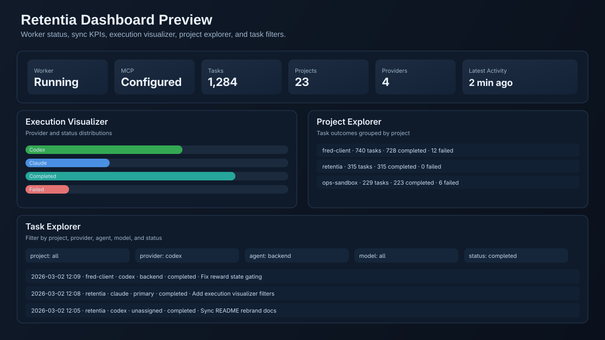

# Retentia VS Code Extension

Retentia for VS Code adds persistent memory workflows, multi-LLM task sync, and execution observability directly into your editor.

Compatibility note:
- Command IDs and settings keys are still `codexMem.*` for backward compatibility.
- CLI integration supports both `retentia` (primary) and legacy `codex-mem` aliases.



## Install

In commands below, `<repo-root>` means the directory where you cloned this repository.

### One-command install (recommended)

```bash
cd <repo-root>
npm run install:vscode
```

This root command installs both the core Retentia runtime and this extension, then runs MCP setup.

### Clean reinstall

```bash
cd <repo-root>
npm run reinstall:vscode
```

Profile-specific reinstall:

```bash
cd <repo-root>
CODEX_MEM_VSCODE_PROFILE="<profile-name>" npm run reinstall:vscode
```

### Development host

```bash
cd <repo-root>/vscode-extension
npm install
npm run build
```

Open `vscode-extension` in VS Code and press `F5`.

### VSIX install

```bash
cd <repo-root>/vscode-extension
npm install
npm run install:local
```

If VS Code CLI is not on PATH:

```bash
CODEX_MEM_VSCODE_CLI="<path-or-command-for-code>" npm run install:local
```

## Commands

| Command title | Command ID | What it does |
| --- | --- | --- |
| `Retentia: Setup (Enable + Start Worker)` | `codexMem.setup` | Enables MCP and starts worker. |
| `Retentia: Enable MCP` | `codexMem.enableMcp` | Registers MCP server in Codex config. |
| `Retentia: Initialize Store` | `codexMem.initStore` | Initializes and verifies local storage. |
| `Retentia: Start Worker` | `codexMem.startWorker` | Starts worker process. |
| `Retentia: Stop Worker` | `codexMem.stopWorker` | Stops worker process. |
| `Retentia: Worker Status` | `codexMem.workerStatus` | Opens worker status payload. |
| `Retentia: Sync LLM Tasks (Codex/Claude/Qwen/Gwen)` | `codexMem.syncCodexTasks` | Imports provider task execution events. |
| `Retentia: Project Explorer + Visualizer` | `codexMem.projectExplorer` | Opens dashboard exploration view. |
| `Retentia: Status Dashboard` | `codexMem.statusDashboard` | Opens full operational dashboard. |
| `Retentia: Open Settings` | `codexMem.openSettings` | Opens extension settings in VS Code. |
| `Retentia: Add Observation` | `codexMem.addObservation` | Interactive observation capture flow. |
| `Retentia: Add Summary` | `codexMem.addSummary` | Interactive summary capture flow. |
| `Retentia: Search Memory` | `codexMem.search` | Search entries and open detail payloads. |
| `Retentia: Generate Context Pack` | `codexMem.contextPack` | Build prompt-ready context pack. |
| `Retentia: Open Memory File` | `codexMem.openMemoryFile` | Open active SQLite file in editor. |

Sidebar:
- `Retentia` activity bar icon includes `Quick Input` for setup, worker controls, task sync, and direct observation/summary entry forms.

## Settings

| Setting | Default | Intent |
| --- | --- | --- |
| `codexMem.cliPath` | `""` | Explicit CLI path (`retentia`, `codex-mem`, or script path). |
| `codexMem.defaultProject` | `""` | Default project for new entries. |
| `codexMem.autoSyncCodexTasks` | `true` | Auto-sync task execution on dashboard refresh. |
| `codexMem.enabledProviders` | `["codex","claude","qwen","gwen"]` | Provider list for ingestion. |
| `codexMem.autoSyncLookbackDays` | `7` | Session log lookback window. |
| `codexMem.autoSyncMaxImport` | `25` | Max imported tasks per sync run. |
| `codexMem.autoSyncMaxFiles` | `24` | Max files scanned per provider. |
| `codexMem.codexSessionsPath` | `""` | Optional Codex sessions path override. |
| `codexMem.claudeSessionsPath` | `""` | Optional Claude sessions path override. |
| `codexMem.qwenSessionsPath` | `""` | Optional Qwen sessions path override. |
| `codexMem.gwenSessionsPath` | `""` | Optional Gwen sessions path override. |
| `codexMem.executionReportLimit` | `600` | Max entries loaded into visualizer/explorers. |

## Dashboard Walkthrough

The dashboard provides:

- Action bar: `Refresh`, `Setup`, `Sync LLM Tasks`, `Start Worker`, `Stop Worker`.
- KPI cards: worker and MCP state, total tasks, projects, providers, agents.
- Runtime panel: PID, uptime, endpoint, MCP command/args, DB file.
- Provider Sync matrix: detected/imported/skipped/failed by provider.
- Execution Visualizer: distribution bars by provider/status/agent/model.
- Project Explorer: per-project totals and outcomes.
- Task Explorer: filterable task list by project/provider/agent/model/status.

## About "Tasks Executed"

`Tasks Executed` reflects persisted memory entries.

- If your workflow does not write memory entries, totals may stay low.
- The extension can auto-import execution events from enabled providers.
- Trigger manual import with `Retentia: Sync LLM Tasks (Codex/Claude/Qwen/Gwen)`.

## CLI Discovery

The extension resolves CLI in this order:

1. `codexMem.cliPath`
2. `<workspace>/dist/cli.js`
3. `<workspace>/../dist/cli.js`
4. `<workspace>/retentia/dist/cli.js`
5. `<workspace>/../retentia/dist/cli.js`
6. `<workspace>/../../retentia/dist/cli.js`
7. `<workspace>/codex-mem/dist/cli.js` (legacy folder fallback)
8. `<workspace>/../codex-mem/dist/cli.js` (legacy folder fallback)
9. `<workspace>/../../codex-mem/dist/cli.js` (legacy folder fallback)
10. `retentia` from PATH

## Troubleshooting

### Commands are missing in command palette

```bash
cd <repo-root>
npm run reinstall:vscode
```

Then:

1. Run `Developer: Reload Window`.
2. Search for `Retentia` in `Ctrl+Shift+P`.

### CLI path resolution fails

Set `codexMem.cliPath` to:

- `<repo-root>/dist/cli.js`, or
- `retentia`, or
- `codex-mem` (legacy alias).

### MCP visible in extension but not active in Codex

```bash
codex mcp list
codex mcp get retentia
cd <repo-root>
node dist/cli.js setup
```

## Development

```bash
cd <repo-root>/vscode-extension
npm install
npm run build
```

Start Extension Development Host with `F5`.
